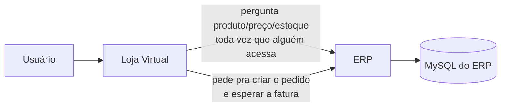
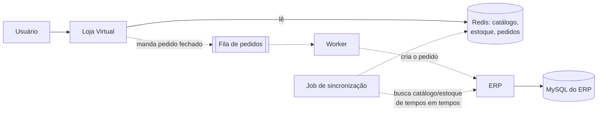
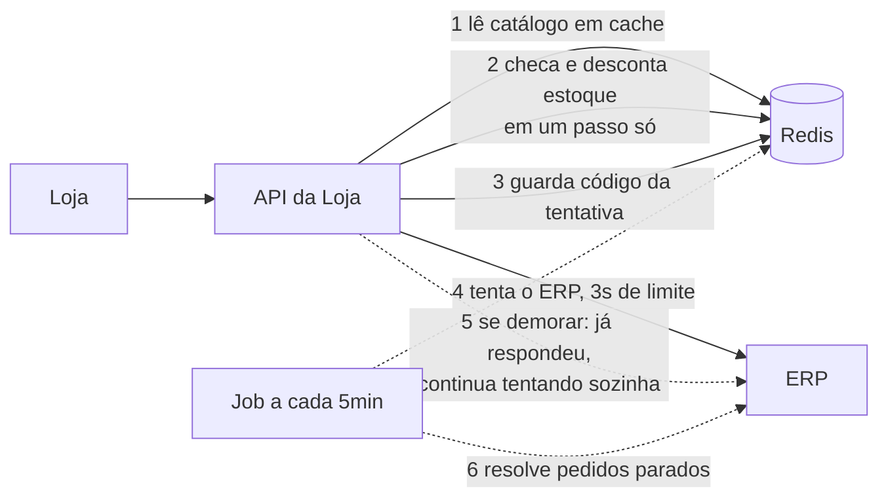
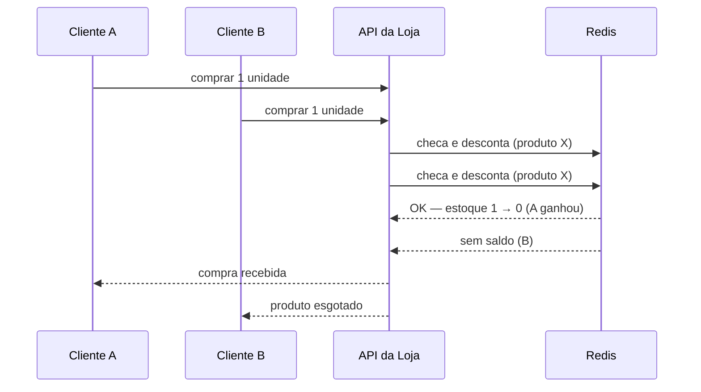
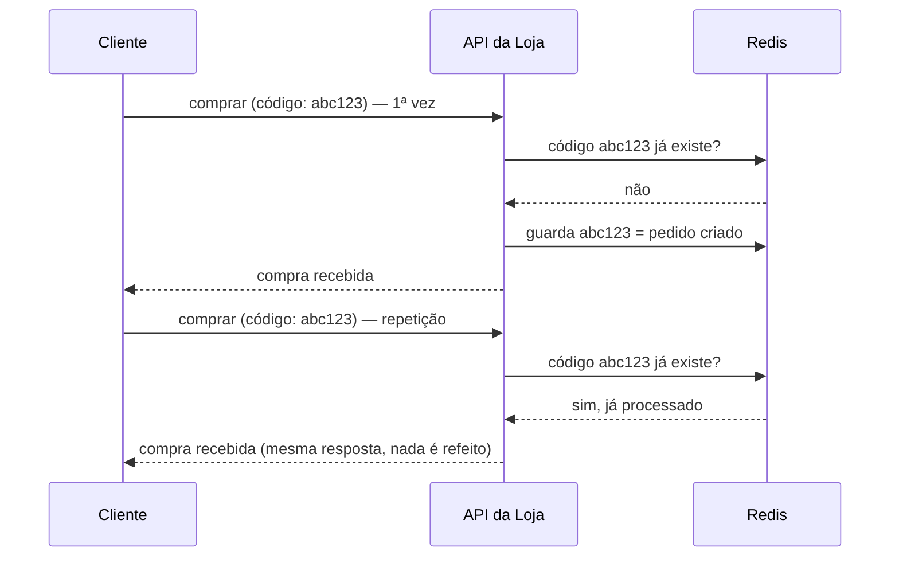

# CaseCellShop — Design Doc

Respostas conceituais (Parte 1.A) do Desafio Técnico CaseCellShop — Nível Pleno | Fullstack.

Autor: Alvaro Machado Ferreira
Data: 2026-09-10

**O objetivo, em uma frase**: reduzir a dependência direta do ERP nas jornadas críticas da loja, melhorar a experiência do cliente e evitar venda sem estoque — de forma incremental, com risco controlado, sem reescrever o ERP.

---

## Índice

0. [Como funciona hoje](#0--como-funciona-hoje)
1. [Pergunta 1 — Diagnóstico e trade-offs](#pergunta-1--diagnóstico-e-trade-offs)
2. [Pergunta 2 — Arquitetura alvo incremental](#pergunta-2--arquitetura-alvo-incremental)
3. [Pergunta 3 — Estoque, concorrência e idempotência](#pergunta-3--estoque-concorrência-e-idempotência)
4. [Pergunta 4 — Contrato de API e modelo de erros](#pergunta-4--contrato-de-api-e-modelo-de-erros)
5. [Pergunta 5 — Testes e estratégia de validação](#pergunta-5--testes-e-estratégia-de-validação)
6. [Pergunta 6 — Uso de IA no desenvolvimento](#pergunta-6--uso-de-ia-no-desenvolvimento)
7. [Resumo das decisões](#resumo-das-decisões)

---

## 0 | Como funciona hoje



A loja não guarda nada — para cada clique do cliente, ela pergunta ao ERP. O ERP foi feito para tocar estoque, faturamento e contabilidade, não para responder milhões de consultas de catálogo. Essa dependência direta, em toda jornada, é a raiz dos três problemas do case.

---

## Pergunta 1 — Diagnóstico e trade-offs

> Para cada um dos 3 problemas: causa, impacto, 2 caminhos possíveis, trade-offs de cada um, e qual eu priorizaria.

### 01 | Performance da vitrine

**Causa**: a loja pergunta ao ERP toda vez que alguém abre a vitrine. Sem nada entre os dois, cada acesso vira uma consulta ao ERP — e com milhões de acessos, isso o sobrecarrega e deixa tudo mais lento.

**Impacto**: o cliente sente a loja lenta e sai antes mesmo de olhar um produto; o negócio perde venda e ainda paga a conta de manter o ERP aguentando um tipo de tráfego que não é dele.

| Caminho | Vantagem | Desvantagem |
|---|---|---|
| **A. Guardar uma cópia rápida do catálogo perto da loja** (cache) | Rápido de fazer, resolve a maior parte do problema em dias | O catálogo pode ficar alguns segundos desatualizado |
| **B. Copiar o catálogo inteiro para um banco próprio da loja** | Loja fica de vez independente do ERP para leitura | Muito mais trabalho para construir e manter sincronizado |

**Escolha**: A primeiro. Resolve rápido, com pouco risco, e vira a base para o resto do plano.

### 02 | Consistência de estoque

**Causa**: checar se tem estoque e confirmar a venda são dois passos separados, sem nada travando o meio do caminho. Se dois clientes fazem isso ao mesmo tempo, os dois podem ver "tem estoque" antes que a venda um do outro seja registrada — e os dois levam a última unidade.

**Impacto**: o cliente compra e depois recebe um cancelamento — perde a confiança na loja. O negócio arca com estorno, atendimento, e o risco de vender algo que fisicamente não tem.

| Caminho | Vantagem | Desvantagem |
|---|---|---|
| **A. A loja controla seu próprio estoque**, num lugar rápido, checando e descontando em um passo só (sem intervalo entre os dois) | Nunca vende além do que tem, mesmo com muita gente comprando ao mesmo tempo | O estoque da loja pode ficar segundos desatualizado em relação ao ERP; precisa comparar os dois de vez em quando |
| **B. Deixar o ERP controlar o estoque**, travando a linha do produto durante a compra | Estoque sempre 100% certo | Volta a depender do ERP em tempo real no momento mais crítico — e o case não permite mexer no ERP |

**Escolha**: A. É a única compatível com a regra de não alterar o ERP, e resolve o problema na raiz.

### 03 | Resiliência do checkout

**Causa**: ao finalizar a compra, a loja espera o ERP terminar de processar o pedido antes de responder ao cliente. Sob carga o ERP demora, a espera estoura o tempo limite, e o cliente não sabe se a compra foi feita.

**Impacto**: o cliente fica sem saber se comprou, pode tentar de novo e arriscar pagar em dobro. O negócio perde vendas e ainda recebe mais tráfego dos clientes tentando de novo.

| Caminho | Vantagem | Desvantagem |
|---|---|---|
| **A. A loja responde rápido** ("recebemos sua compra") **e termina de processar com o ERP em segundo plano** | O cliente nunca fica esperando o ERP; a loja não trava | Precisa avisar o cliente depois, quando a compra for de fato confirmada |
| **B. Manter como está, só com um tempo limite mais curto** | Não muda nada na tela | Não resolve o problema — só troca "demora muito" por "erra mais rápido" |

**Escolha**: A. É o único caminho que realmente tira o ERP do meio do caminho crítico da compra.

---

## Pergunta 2 — Arquitetura alvo incremental

> Proponha uma arquitetura para evoluir a loja sem depender do ERP em cada requisição crítica: componentes, fluxo de dados, onde usar cache/fila/banco/jobs, sincronização com o ERP, e o que fazer primeiro em 30-90 dias.

**A ideia central**: hoje a loja pergunta tudo ao ERP, na hora, toda vez. A mudança é simples de descrever — a loja passa a ter sua própria cópia rápida do que precisa (catálogo e estoque), e só manda ao ERP o que ele realmente precisa saber (pedidos fechados), em segundo plano, sem travar o cliente.



**Componentes**: a loja (front), uma API própria da loja, um lugar rápido para guardar catálogo/estoque/pedidos (Redis), uma fila para mandar pedidos ao ERP sem travar o cliente, e um worker que processa essa fila.

**Como os dados fluem**:
- **Catálogo e estoque**: um job busca esses dados do ERP de tempos em tempos e atualiza a cópia da loja.
- **Checkout**: a loja reserva o estoque na própria cópia (sem perguntar ao ERP), responde rápido ao cliente, e manda o pedido para o ERP em segundo plano.

**Uma regra que sigo à risca**: só o ERP escreve estoque e catálogo de verdade; a loja só lê esses dados. A única coisa que a loja escreve de volta para o ERP é o pedido fechado — e sempre pela fila, nunca direto, nunca de dois lugares diferentes do código. Isso evita que loja e ERP fiquem desincronizados por causa de duas escritas concorrentes brigando por ordem.

### O que fazer primeiro

#### Fase 1 — 0 a 30 dias (a mais rápida de implementar)



Sem banco novo, sem fila de verdade ainda — um único Redis resolve os três problemas com o menor esforço possível:

1. **Catálogo em cache**, atualizado a cada ~30 segundos — resolve o problema 1 quase de graça.
2. **Estoque controlado no mesmo Redis**: checar se tem saldo e descontar, em um passo só, sem intervalo entre os dois — resolve o problema 2, sem tocar no ERP.
3. **Cada tentativa de compra carrega um código único.** Se a mesma tentativa chegar de novo (clique duplo, erro de rede), a loja devolve a mesma resposta, sem duplicar nada.
4. **O checkout tenta o ERP com um tempo limite curto** (3 segundos). Se responder a tempo, ótimo.
5. **Se demorar mais que isso**, a loja já respondeu "recebemos sua compra" ao cliente, e continua tentando o ERP sozinha, mais algumas vezes — resolve o problema 3, sem precisar de fila ainda.
6. **A cada 5 minutos**, um job confere se algum pedido ficou parado por tempo demais e resolve isso sozinho (confirma ou marca como falha, e libera o estoque se for o caso).

O preço dessa simplicidade: se a loja reiniciar bem no meio de uma tentativa de reenviar um pedido ao ERP, esse pedido fica esperando até o job de 5 minutos resolver. É um atraso pequeno, não uma venda perdida — o estoque já estava garantido desde o passo 2.

#### Fase 2 — 30 a 60 dias

Troca a tentativa "por conta própria" (passo 5) por uma fila de verdade — o pedido nunca se perde, mesmo se a loja reiniciar. Move estoque e pedidos do Redis para um banco próprio da loja, mais durável. O cache de catálogo continua igual.

#### Fase 3 — 60 a 90 dias

O catálogo passa a se atualizar quase em tempo real, em vez de a cada poucos minutos — com cuidado, porque não temos acesso para mudar o ERP nem garantia de que a estrutura interna dele não muda, então essa sincronização mais rápida só pode usar formas que o próprio ERP já oferece para consultar dados, nunca acessar o banco dele por baixo dos panos. O job de reconciliação (passo 6) vira automático, e a loja passa a mostrar ao cliente o status detalhado do pedido.

---

## Pergunta 3 — Estoque, concorrência e idempotência

> Dois clientes tentam comprar a última unidade ao mesmo tempo: como evitar venda duplicada, quando a reserva é criada e expira, como lidar com retry/timeout/duplo clique, como usar idempotência, como reconciliar loja e ERP.

### Dois clientes disputando a última unidade



- **Como evita venda duplicada**: checar o saldo e descontar a unidade acontecem como uma única operação no Redis — não existe intervalo entre os dois onde outra requisição possa se intrometer. Não é sorte de tempo: é impossível dois clientes "passarem" ao mesmo tempo pela mesma unidade, porque o Redis processa essa operação de forma indivisível.
- **Quando a reserva é criada e expira**: criada no exato momento em que o cliente tenta comprar, antes de qualquer chamada ao ERP. Expira em 2 minutos — tempo suficiente para a loja tentar o ERP algumas vezes (passos 4 e 5 da Fase 1) com folga, sem ser um "tempo de carrinho" (não existe carrinho nem pagamento neste fluxo). Se o prazo passar sem confirmação, duas coisas acontecem juntas: o estoque volta a ficar disponível, e o pedido é marcado como falho, para nenhuma tentativa de reenvio continuar rodando depois que o estoque já foi liberado para outro cliente.
- **Retry, timeout, duplo clique**: o cliente informa quantidade e clica em comprar; a tela desabilita o botão assim que ele clica, para não deixar mandar duas vezes. Mesmo assim, qualquer reenvio da mesma tentativa (rede falhou, botão não desabilitou a tempo, o que for) carrega o mesmo código de tentativa.

### Duplo clique / retry com o mesmo código de tentativa



- **Como uso idempotência**: cada tentativa de compra carrega um código único, gerado pela tela no momento do clique. Antes de processar qualquer coisa, a loja checa se esse código já apareceu. Se já apareceu, devolve a mesma resposta de antes, sem reservar estoque de novo nem chamar o ERP de novo. Se é novo, processa normalmente e guarda o código como concluído. Isso resolve retry de rede, duplo clique, e qualquer reenvio acidental — sem precisar de nada além dessa checagem simples.
- **Como reconciliar loja e ERP**: o job que roda a cada 5 minutos (Fase 1) compara os pedidos que ficaram "pendentes" com o que o ERP realmente registrou. Se o ERP processou, o pedido é confirmado; se não, é marcado como falho e o estoque é liberado. Se a mesma divergência persistir por muito tempo, isso vira um alerta para olhar manualmente.

---

## Pergunta 4 — Contrato de API e modelo de erros

> Contrato do `POST /checkout`: payload, sucesso, erro de validação, estoque insuficiente, falha temporária do ERP, códigos HTTP e como o front-end reage a cada caso.

O contrato abaixo aceita um produto e uma quantidade por tentativa — não um carrinho com vários itens. É assim porque o case descreve a compra desse jeito ("escolha uma quantidade e tente finalizar uma compra"), e porque reservar vários produtos ao mesmo tempo deixaria de ser aquele "passo único" simples do problema 2 — cada produto a mais é mais uma chance de dois clientes disputarem coisas diferentes ao mesmo tempo, o que pede um cuidado bem maior do que apenas repetir a mesma solução várias vezes.

### `POST /checkout`

**Payload**
```json
{
  "productId": "string",
  "quantity": 1,
  "idempotencyKey": "uuid-v4"
}
```

**Sucesso — compra recebida, ERP processando**
`202 Accepted`
```json
{
  "orderId": "ord_8f21ac",
  "status": "pending",
  "statusUrl": "/orders/ord_8f21ac"
}
```

**Erro de validação**
`400 Bad Request`
```json
{
  "error": {
    "code": "VALIDATION_ERROR",
    "message": "A quantidade deve ser maior que zero.",
    "field": "quantity"
  }
}
```

**Produto não existe**
`404 Not Found`
```json
{
  "error": {
    "code": "PRODUCT_NOT_FOUND",
    "message": "Produto não encontrado."
  }
}
```

**Estoque insuficiente**
`409 Conflict`
```json
{
  "error": {
    "code": "OUT_OF_STOCK",
    "message": "Este produto está esgotado no momento."
  }
}
```

**Falha temporária do ERP** — não é um erro imediato do `POST /checkout` (a reserva já foi feita); aparece depois, consultando `GET /orders/{id}`:
```json
{
  "orderId": "ord_8f21ac",
  "status": "failed",
  "error": {
    "code": "ERP_PROCESSING_FAILED",
    "message": "Não conseguimos concluir seu pedido agora. Tente novamente."
  }
}
```

**Reenvio com o mesmo código de tentativa**: `200 OK`, devolve o mesmo resultado da primeira vez.

### Como o front-end reage

| Resposta | O que a tela faz |
|---|---|
| `202` + `pending` | Mostra "processando" e consulta `statusUrl` de tempos em tempos |
| `400 VALIDATION_ERROR` | Mostra o erro perto do campo, deixa tentar de novo |
| `404 PRODUCT_NOT_FOUND` | Mostra que o produto não existe mais |
| `409 OUT_OF_STOCK` | Mostra "esgotado" e atualiza o estoque exibido |
| `status: failed` (na consulta) | Mostra falha temporária, libera o botão para nova tentativa (novo código) |
| `status: confirmed` (na consulta) | Mostra confirmação de compra |
| Erro inesperado | Mensagem genérica, permite tentar de novo com o mesmo código |

---

## Pergunta 5 — Testes e estratégia de validação

> Testes unitários, integração de API, contrato front/back, concorrência, estados do front-end, o que automatizar agora vs. depois.

- **Unitários**: cálculo de estoque disponível, validação do payload, checagem do código de tentativa.
- **Integração de API**: os quatro cenários principais — sucesso, erro de validação, estoque insuficiente, falha simulada do ERP — rodando contra o backend de verdade.
- **Contrato front/back**: um schema compartilhado (ex. Zod) validado nos dois lados; testes de contrato formais ficam para depois, não são prioridade agora.
- **Concorrência**: disparar várias tentativas de compra ao mesmo tempo para um produto com 1 unidade em estoque, e confirmar que só uma tem sucesso.
- **Estados do front-end**: loading, botão desabilitado durante o processamento, e as mensagens de cada tipo de erro.
- **Automatizo agora**: os testes acima.
- **Deixo documentado como próximo passo**: testes de contrato formal, testes de carga da vitrine, testes ponta a ponta completos.

---

## Pergunta 6 — Uso de IA no desenvolvimento

> Que prompts usar, o que delegar ou não, como verificar, riscos de aceitar sem revisão.

- **Tipo de prompt**: gerar código repetitivo (rotas, tipos, testes), revisar ideias de arquitetura, ajudar a escrever este documento e o README.
- **Delego**: código repetitivo, testes, documentação, explorar alternativas de design.
- **Não delego**: a decisão final de arquitetura, o desenho de estoque/reserva/idempotência, e a lógica de concorrência — pontos onde um erro sutil afeta venda ou estoque de verdade.
- **Como verifico**: rodo os testes (principalmente o de concorrência), releio à mão qualquer trecho que mexa com a operação de checar-e-descontar estoque, e comparo com os critérios do case.
- **Riscos de aceitar sem revisar**: a IA pode sugerir uma solução de concorrência que parece certa mas tem uma brecha sutil (ex. checar e escrever em dois passos separados, reabrindo o problema 2), ou escrever um teste que não testa de verdade o cenário de concorrência — por isso essas partes exigem leitura crítica, não só rodar e ver que passou.

---

## Resumo das decisões

| Decisão | Por quê |
|---|---|
| Cache de catálogo no Redis (Fase 1) | Resolve a lentidão da vitrine rápido, sem montar banco novo |
| Estoque controlado no Redis, checagem e desconto em um passo só | Único jeito de nunca vender além do estoque sem mexer no ERP |
| Código único por tentativa de compra | Evita pedido duplicado em retry/clique duplo, sem infraestrutura pesada |
| Checkout responde rápido e termina com o ERP em segundo plano | Tira o ERP do caminho crítico da compra |
| Fila simples de pedidos, não um sistema de streaming (Fase 2) | O volume não justifica a complexidade extra; cada pedido só precisa de tentativa e confirmação |
| Sincronização com o ERP só por consulta, nunca acessando o banco dele por baixo | Não temos permissão para alterar o ERP nem garantia de que sua estrutura interna não muda |
| Checkout aceita um produto por vez, sem carrinho | O case descreve a compra assim; vários produtos na mesma tentativa complicaria bem mais a reserva de estoque |

Trechos de referência usados para embasar essas decisões técnicas estão documentados em [`referencias/`](referencias/), para quem quiser aprofundar.
