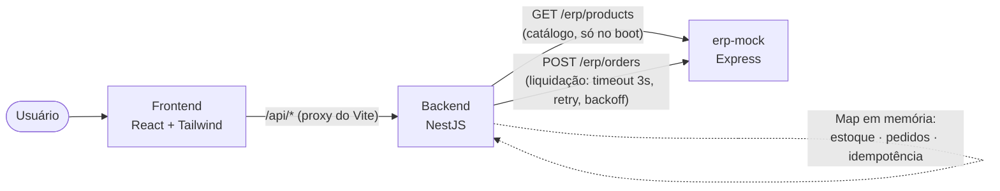

# CaseCellShop — Checkout

Uma fatia fullstack executável de uma jornada de checkout de e-commerce: o cliente escolhe um produto e uma quantidade, tenta comprar, e o sistema garante que nunca vende além do estoque disponível, nunca duplica um pedido em caso de retry ou duplo clique, e sempre responde rápido mesmo quando o sistema de ERP usado como backend de faturamento está lento ou instável.

O repositório contém três processos Node.js independentes — `erp-mock/`, `backend/`, `frontend/` — sem necessidade de Docker ou ferramenta de orquestração. Um quarto pacote, `e2e/`, contém testes end-to-end (Playwright) que sobem os três juntos e dirigem um navegador real contra a aplicação.

| Item bônus | Onde ver | Resultado |
|---|---|---|
| Diagrama de arquitetura | [Arquitetura e principais decisões técnicas](#arquitetura-e-principais-decisões-técnicas) | Fluxo completo usuário → frontend → backend → `erp-mock`, com a fronteira em memória explícita |
| Logs estruturados | [Rastreabilidade](#rastreabilidade-logs-estruturados-em-todo-o-fluxo) · [`evidencias/logs-backend.md`](evidencias/logs-backend.md) | Captura real cobrindo caminho feliz, os 4 tipos de erro, concorrência pela última unidade, idempotência e esgotamento de retry com o ERP |
| Endpoint de status do pedido | `GET /orders/:id` | Retorna `pending` / `confirmed` / `failed` (com `error.code`/`error.message` quando falha) |
| Teste de concorrência | [Armazenamento em memória](#armazenamento-em-memória-sem-banco-de-dados-ou-cache-externo) | Várias requisições simultâneas pela última unidade de estoque — exatamente uma reserva passa, as demais recusadas com `409` |

## Pré-requisitos

- Node.js 20 LTS
- npm

## Instalação e execução

### Rodando tudo com um comando

```bash
npm run install:all   # instala erp-mock, backend e frontend de uma vez
npm run dev            # sobe os três juntos, com saída colorida e prefixada
```

Os dois comandos rodam na raiz do repositório (`package.json` novo, com [`concurrently`](https://www.npmjs.com/package/concurrently) orquestrando os três processos). `Ctrl+C` derruba os três de uma vez. É equivalente ao passo a passo manual abaixo — use aquele se quiser rodar/reiniciar um serviço isoladamente, ou este para o dia a dia.

### Passo a passo manual

Cada pacote é instalado e iniciado de forma independente, em seu próprio terminal, **nesta ordem** — o backend busca o catálogo de produtos no `erp-mock` assim que sobe (e falha ao iniciar se não conseguir), então `erp-mock` precisa estar de pé primeiro; o frontend precisa do backend para qualquer dado real.

**1. ERP mock — porta 4000**

```bash
cd erp-mock
npm install
npm run dev
```

**2. Backend — porta 3001**

```bash
cd backend
npm install
npm run start:dev
```

**3. Frontend — porta 5173**

```bash
cd frontend
npm install
npm run dev
```

Abra `http://localhost:5173`. O servidor de desenvolvimento do Vite (frontend) faz proxy de `/api/*` para `http://localhost:3001` (veja `frontend/vite.config.ts`), então o navegador nunca fala diretamente com a porta do backend — apenas através desse proxy.

A API do backend tem documentação interativa (Swagger/OpenAPI) em `http://localhost:3001/docs` — schema completo (incluindo os corpos de erro de cada status) em `http://localhost:3001/docs-json`.

Nenhum dos três serviços precisa de arquivo `.env` para rodar com os valores padrão. `PORT` muda a porta do `erp-mock`/`backend`; o backend também lê `ERP_MOCK_URL` (a URL da instância de `erp-mock` a ser chamada, padrão `http://localhost:4000`), e `ERP_SIM_MODE`/`ERP_SIM_DELAY_MS` (repassadas como headers para o `erp-mock` para forçar um comportamento simulado específico do ERP — `always-success`/`always-fail`/`always-timeout`/`random` — em vez do comportamento aleatório padrão). É assim que a suíte de testes e2e aponta o backend para uma instância de teste dedicada do `erp-mock` e conduz cada cenário de forma determinística; veja `backend/test/global-setup.ts` e `backend/src/erp/erp.service.ts`.

## Rodando os testes

**`erp-mock/`** (Jest + Supertest, executado diretamente contra o `app` do Express, sem precisar vincular porta):

```bash
cd erp-mock
npm test               # ou npm run test:coverage para o relatório de cobertura
```

**`backend/`** (Jest):

```bash
cd backend
npm test                    # testes unitários (*.spec.ts) — regras de negócio de ProductsService e CheckoutService
npm run test:e2e            # testes end-to-end (*.e2e-spec.ts) — contrato HTTP completo, incl. concorrência e idempotência
npm run test:coverage       # cobertura dos unitários
npm run test:e2e:coverage   # cobertura da suíte e2e
```

`npm run test:e2e` sobe o `erp-mock` automaticamente como um processo filho antes da suíte rodar e o encerra depois (`test/global-setup.ts` / `test/global-teardown.ts`, que fazem polling em `GET /health` antes de liberar os testes) — você **não** precisa ter o `erp-mock` já rodando em outro terminal especificamente para esse comando. Ele ainda é necessário como processo separado para o `start:dev`/uso manual do próprio backend, e para o fluxo do frontend acima.

**`frontend/`** (Vitest + React Testing Library):

```bash
cd frontend
npm test               # ou npm run test:coverage para o relatório de cobertura
```

**`e2e/`** (Playwright — sobe os três serviços de verdade e testa pelo navegador):

```bash
cd e2e
npm install
npx playwright install chromium   # só na primeira vez
npm test
```

Diferente das suítes acima, essa não testa uma unidade nem um contrato HTTP isolado — ela sobe `erp-mock`, `backend` e `frontend` como processos reais (via `webServer` do `playwright.config.ts`) e dirige um navegador Chromium contra a UI, cobrindo o caminho feliz, bloqueio por falta de estoque, duplo clique, validação de entrada e uma falha simulada do ERP com recuperação. Por isso ela precisa que as portas 4000/3001/5173 estejam livres antes de rodar (encerre qualquer instância manual dos três serviços da seção "Instalação e execução"). Cada execução grava vídeo, screenshot e trace de cada teste em `e2e/test-results/` (git-ignorado); veja `evidencias/` na raiz do repositório para uma amostra já gravada.

Existe ainda uma segunda config, isolada, dedicada a exercitar o modo `always-timeout` do ERP de verdade (não simulado no navegador) — veja [a seção sobre a simulação de lentidão/instabilidade do ERP](#demonstrando-a-simulação-de-lentidãoinstabilidade-do-erp) logo abaixo:

```bash
npm run test:erp-lento   # dentro de e2e/ — sobe um segundo trio de serviços, em portas próprias
npm run test:all         # roda as duas suítes Playwright em sequência
```

## Cenários de teste manual

Com os três serviços de pé (`npm run dev`, numa aba separada), `scripts/scenarios.sh` dispara cenários reais contra a API via `curl`, com saída legível — útil pra explorar o comportamento na mão sem escrever `curl` a cada vez:

```bash
scripts/scenarios.sh all   # roda todos os cenários abaixo (exceto erp-slow) em sequência
```

| Comando | O que faz |
|---|---|
| `products` | `GET /products`, formatado |
| `happy` | Checkout de 1 unidade, com polling até `confirmed` |
| `out-of-stock` | Pede mais unidades do que há em estoque disponível |
| `concurrency` | Dispara `estoque+1` requisições concorrentes pela última unidade, conta `202` vs. `409` |
| `idempotency` | Duas chamadas com a mesma `Idempotency-Key` no body, confirma que é o mesmo `orderId` |
| `idempotency-header` | O mesmo, mas mandando a chave no header `Idempotency-Key` em vez do body |
| `validation` | Três payloads inválidos (sem `productId`, `quantity` fracionária, `quantity` zero) → `400 VALIDATION_ERROR` |
| `not-found` | Checkout para um `productId` que não existe → `404 PRODUCT_NOT_FOUND` |
| `order-not-found` | Consulta um `orderId` que não existe → `404 ORDER_NOT_FOUND` |
| `erp-failure` | Roda um checkout e reporta o desfecho real do ERP |
| `erp-random` | 3 checkouts em sequência contra o modo `random` padrão, mostrando status e duração variando de tentativa pra tentativa |
| `erp-slow` | Checkout contra um backend iniciado com `ERP_SIM_MODE=always-timeout` — processamento lento de verdade, não simulado (ver seção abaixo) |
| `status <orderId>` | Consulta um pedido específico |

O cenário `erp-failure` só é determinístico se o backend tiver sido iniciado com `ERP_SIM_MODE=always-fail npm run dev` (ver "Instalação e execução" acima) — com o modo `random` padrão, o script avisa isso na tela e reporta o que aconteceu de verdade. O script não sobe nem derruba nenhum processo — só assume que `npm run dev` já está rodando em outra aba.

## Demonstrando a simulação de lentidão/instabilidade do ERP

Esse é um pré-requisito explícito do case, então aqui vai o passo a passo direto:

O `erp-mock` (`erp-mock/src/app.ts`, endpoint `POST /erp/orders`) simula quatro modos, escolhidos pelo header `X-Erp-Simulate-Mode` que o backend envia em toda chamada — o backend, por sua vez, decide qual mandar a partir das variáveis de ambiente `ERP_SIM_MODE`/`ERP_SIM_DELAY_MS` com que foi iniciado:

| Modo | Comportamento no `erp-mock` |
|---|---|
| `random` (padrão, sem configurar nada) | Delay aleatório de 500–4000ms + ~80% de chance de sucesso — mistura lentidão e instabilidade organicamente, do jeito que um ERP real se comportaria |
| `always-timeout` | Dorme 10s antes de responder — **sempre** mais que o timeout de 3s que o backend usa (`Promise.race` em `checkout.service.ts`), então o backend sempre perde a corrida contra o relógio: é "processamento lento" no sentido mais literal do requisito |
| `always-fail` | Responde rápido, mas com `success: false` — falha determinística sem lentidão, para isolar o caso de "instabilidade" do caso de "lentidão" |
| `always-success` | Responde rápido com `success: true` — usado pelos cenários de caminho feliz, pra eles não dependerem de sorte |

O backend tenta até 3 vezes, com timeout de 3s por tentativa e backoff de 1s/2s entre elas (`CheckoutService.settleWithErp`) — o pedido só é marcado `failed`/`ERP_PROCESSING_FAILED` depois de esgotar as três. Três formas de ver isso rodando, da mais rápida pra mais completa:

**1. Automatizado, sem nenhum passo manual — o que a captura abaixo mostra:**

```bash
cd e2e
npm run test:erp-lento
```

Isso sobe um segundo trio `erp-mock`+`backend`+`frontend` (portas 4001/3002/5174, isolado da suíte principal) com o backend em `ERP_SIM_MODE=always-timeout`, e dirige um navegador de verdade contra ele — sem `page.route()` nenhum fingindo a resposta: é o `Promise.race` real do backend perdendo contra o `erp-mock` real, três vezes, até a UI mostrar a mensagem de falha.


**2. Manual, via `scripts/scenarios.sh`:**

```bash
# terminal 1
cd backend && ERP_SIM_MODE=always-timeout npm run start:dev

# terminal 2 (erp-mock e frontend já de pé como de costume)
scripts/scenarios.sh erp-slow
```

O script acompanha o pedido até ele terminar `failed`. No log do backend, cada tentativa desiste em ~3s (não em 10s — é o timeout do backend vencendo, não o `erp-mock` respondendo rápido), e a resposta real do `erp-mock` chega bem depois, já ignorada:

```
19:14:41  LOG   [CheckoutService] Chamando o ERP — orderId=ord_000001 attempt=1/3 timeoutMs=3000
19:14:44  WARN  [CheckoutService] Tentativa de liquidação falhou — orderId=ord_000001 attempt=1/3
19:14:44  LOG   [CheckoutService] Aguardando antes da próxima tentativa — orderId=ord_000001 backoffMs=1000
19:14:45  LOG   [CheckoutService] Chamando o ERP — orderId=ord_000001 attempt=2/3 timeoutMs=3000
19:14:48  WARN  [CheckoutService] Tentativa de liquidação falhou — orderId=ord_000001 attempt=2/3
19:14:50  LOG   [CheckoutService] Chamando o ERP — orderId=ord_000001 attempt=3/3 timeoutMs=3000
19:14:53  WARN  [CheckoutService] Tentativa de liquidação falhou — orderId=ord_000001 attempt=3/3
19:14:53  ERROR [CheckoutService] Pedido falhou definitivamente após esgotar as tentativas — orderId=ord_000001 attempts=3
19:14:55  DEBUG [ErpService] erp-mock respondeu — httpStatus=200 success=true durationMs=10005   # tarde demais, já ignorada
```

Captura completa (todas as linhas, sem cortes) em [`evidencias/logs-backend.md`, seção 11](evidencias/logs-backend.md#11-erp-sempre-lento-always-timeout--promiserace-perdendo-contra-o-relógio).

**3. Sem reiniciar nada — o modo `random` padrão já demonstra a instabilidade ao vivo:**

```bash
scripts/scenarios.sh erp-random
```

Dispara 3 checkouts seguidos contra o backend já rodando do jeito padrão e mostra status/duração de cada um lado a lado — a variação entre eles **é** a simulação.

Captura real de terminal cobrindo os três modos (`always-success`, `always-fail`, `always-timeout`) está em [`evidencias/logs-backend.md`](evidencias/logs-backend.md), comentada trecho a trecho.

## Arquitetura e principais decisões técnicas



*A reserva de estoque, os pedidos e as chaves de idempotência vivem inteiramente dentro do processo do backend — o `erp-mock` nunca é consultado durante a checagem-e-reserva, só na liquidação em segundo plano e na busca do catálogo no boot (ver as duas seções abaixo).*

### Por que `erp-mock` é um serviço HTTP real separado, e não uma simulação in-process

O backend chama o `erp-mock` através de uma fronteira de rede real (HTTP, processo próprio, porta própria) em vez de simular o comportamento do ERP com uma classe in-process. Essa é uma escolha deliberada de gestão de risco, não incidental: uma simulação in-process não consegue exercitar os modos de falha que realmente importam para a resiliência do checkout — reset de conexão, um timeout que de fato precisa correr contra o relógio (`Promise.race` perdendo, não apenas uma função retornando um erro), uma resposta lenta competindo com o próprio event loop do backend. Um segundo processo real também é o que obriga o modo de simulação do `erp-mock` a ser **stateless e controlado por header**, em vez de configuração no lado do servidor: duas tentativas de checkout concorrentes na mesma execução de teste podem exigir comportamentos simulados diferentes (`always-success` vs. `always-timeout`) sem disputar um estado mutável compartilhado.

O `erp-mock` é um serviço Express simples, e não uma segunda aplicação NestJS — é um dublê de teste representando um sistema fora do controle deste projeto, não parte do produto sendo construído.

### Catálogo: o ERP é o dono dos dados, a loja só lê

Produto, preço, estoque contábil e a foto de cada capinha são dados que o `erp-mock` expõe em `GET /erp/products` — não um array chumbado dentro do backend. O `ProductsModule` busca esse catálogo **uma vez, na inicialização** (`ProductsService` é montado por um provider assíncrono que chama `ErpService.fetchCatalog()` antes do Nest terminar de subir o módulo — veja `backend/src/products/products.module.ts`); se o `erp-mock` não responder nesse momento, o backend falha ao iniciar em vez de subir com um catálogo vazio ou inventado.

Esse é o mesmo princípio do plano de arquitetura incremental documentado em [`referencias/decisoes-tecnicas.md`](referencias/decisoes-tecnicas.md): o ERP é sempre o único *escritor* de catálogo/preço/estoque contábil, a loja é sempre *leitora* — nunca o contrário. A diferença é só o meio: lá a sincronização é um job periódico (pull a cada 1–5 min); aqui, simplificada para uma busca única no boot, porque não há como o catálogo mudar depois que o processo já está de pé. O que **não** muda com essa simplificação é a fronteira mais importante: depois que o catálogo é carregado, a reserva/decremento de estoque continua inteiramente local ao `ProductsService` (ver seção seguinte) — nenhuma chamada ao ERP acontece durante um checkout, só no boot.

### Arquitetura do backend: Controller, Service, Module

O backend segue uma estrutura NestJS direta — um `Controller`, um `Service`, um `Module` por assunto (`products/`, `orders/`, `idempotency/`, `erp/`, `checkout/`). Cada `Controller` faz apenas roteamento: nenhuma regra de negócio, nenhum mapeamento de erro para status HTTP (isso é centralizado uma única vez, no `HttpExceptionFilter` global). Cada `Service` é dono tanto da lógica de negócio quanto dos dados sobre os quais ela opera, em um só lugar, sem camadas de indireção adicionais entre o controller e a regra de negócio. Erros de domínio (produto não encontrado, estoque insuficiente, pedido não encontrado) são exceções tipadas que estendem `HttpException` diretamente, e métodos/variáveis usam o vocabulário real do negócio (`reserveStock`, `settleWithErp`, `idempotencyKey`) em vez de nomenclatura CRUD genérica.

`ProductsService` combina o catálogo de produtos e a reserva de estoque no mesmo serviço porque `GET /products` precisa dos dois, e separá-los em dois serviços que dependem um do outro criaria uma dependência circular sem benefício nesta escala.

### Armazenamento em memória, sem banco de dados ou cache externo

Estoque, pedidos e chaves de idempotência vivem em `Map`s em memória, dentro do próprio processo do backend — adequado para um serviço de demonstração de vida curta, processo único. A garantia de correção que realmente importa é preservada mesmo sem infraestrutura externa: a operação de verificar-e-decrementar estoque roda como um passo indivisível porque permanece totalmente síncrona (sem `await` entre checar disponibilidade e reservar) dentro de um serviço singleton — o event loop do JavaScript nunca intercala duas chamadas à mesma função síncrona, então duas requisições concorrentes para a última unidade nunca podem ambas "passar" na verificação. O teste e2e de concorrência do backend (disparando várias tentativas de checkout simultâneas contra um produto com 1 unidade em estoque) é a garantia de regressão para isso.

### Frontend: Tailwind e fotos reais dos produtos

A tela de checkout é responsiva (testada de ~360px a desktop) e usa Tailwind CSS v4 (via `@tailwindcss/vite`, sem arquivo de config separado — os tokens de cor e tipografia vivem em `frontend/src/index.css`). O seletor de produto deixou de ser um `<select>` para virar um grupo de cards clicáveis (`role="radiogroup"`, um `<input type="radio">` acessível por trás de cada card), porque a foto do produto — vinda de `product.imageUrl`/`imageAlt`, ver "Catálogo" acima — só faz sentido como algo grande o bastante para ver a textura da capinha; um dropdown não comporta isso. O card também mostra preço e estoque disponível, recarregado do backend assim que uma compra reserva ou libera estoque, sem precisar dar reload na página.

`frontend/src/` é organizado por responsabilidade, não por tipo de arquivo genérico: `services/` fala com o backend (um módulo por recurso — `products`, `checkout`, `orders` — cada um só com as chamadas `fetch` e os tipos daquele recurso); `hooks/` (`useProducts`, `useCheckout`) guardam o estado e a lógica de quando chamar cada serviço, incluindo o polling do status do pedido; `view/` são componentes de apresentação que só recebem props e renderizam; `controller/CheckoutController.tsx` é o único lugar que conecta hooks a views; `utils/` guarda funções puras sem estado (formatação de moeda, montagem de URL de imagem). Essa separação usa o mesmo vocabulário do backend (`services`) de propósito, e existe por um motivo concreto, não só organização por gosto: antes, uma função de ~90 linhas fazia fetch, tratava todos os erros e renderizava tudo junto, e um erro de rede (não um erro HTTP — uma falha de conexão de verdade) não era capturado em lugar nenhum, deixando o botão "Processando..." travado para sempre. Isolar a chamada de rede dentro de `hooks/useCheckout.ts` tornou esse ponto óbvio o bastante para corrigir: agora `postCheckout`/`fetchOrderStatus` são chamados dentro de um `try/catch` que sempre leva a UI de volta a um estado de erro navegável.

### Por que a idempotência só guarda em cache a resposta de sucesso

Uma requisição `POST /checkout` que falha na validação, ou aponta para um produto inexistente, ou esbarra em estoque insuficiente, é uma função pura da entrada e do nível de estoque atual — reenviar exatamente a mesma requisição recalcula exatamente a mesma resposta, sem efeito colateral para repetir acidentalmente. A única resposta que não é pura é o sucesso `202 pending`, porque ela tem um efeito colateral: cria um pedido e reserva estoque. Por isso só esse caminho é lembrado em relação à `Idempotency-Key` — reenviar a mesma chave retorna o pedido *original* em vez de criar um segundo pedido e reservar estoque em dobro.

### Rastreabilidade: logs estruturados em todo o fluxo

Cada classe do backend tem seu próprio `Logger` do NestJS (`new Logger(NomeDaClasse.name)`), e todo ponto de decisão do fluxo é logado — não só os erros: pedido recebido, resposta idempotente reaproveitada, estoque reservado/recusado/confirmado/liberado (inclusive quando uma reserva expira sozinha por TTL), cada tentativa de chamada ao ERP com seu resultado, o backoff entre tentativas, e o desfecho final do pedido. As mensagens seguem um padrão consistente de `mensagem em português — campo1=valor1 campo2=valor2`, para ficarem ao mesmo tempo legíveis por humano e fáceis de grep. Os níveis são usados com intenção: `log` para o caminho esperado, `warn` para falhas de negócio recuperáveis (estoque insuficiente, tentativa de ERP que falhou mas ainda tem retry, um pedido marcado `failed`), `error` só para o que realmente esgotou as opções (falha definitiva após as 3 tentativas, exceção não tratada), e `debug` para ruído de diagnóstico de baixo sinal (hit/miss de idempotência, guards que decidiram não fazer nada).

Duas chaves de correlação amarram essas linhas: um `requestId` curto, gerado por `RequestLoggerMiddleware` para toda requisição HTTP (reaproveita um `X-Request-Id` recebido, se houver, e sempre devolve um no header de resposta) e logado nas linhas de entrada/saída (`--> POST /checkout ...` / `<-- POST /checkout ... status=202 durationMs=...`); e o `orderId`, que passa a ser a chave de correlação a partir do momento em que um pedido existe — inclusive na liquidação assíncrona com o ERP, que roda bem depois da requisição HTTP original já ter sido respondida e por isso não tem mais um `requestId` "ativo" a que se prender.

Uma captura real desses logs, cobrindo o caminho feliz, os quatro tipos de erro (`400`/`404`/`409`/pedido `failed`), duas tentativas concorrentes pela última unidade de um produto, o reaproveitamento idempotente, e o esgotamento das 3 tentativas contra o ERP, está em [`evidencias/logs-backend.md`](evidencias/logs-backend.md) (comentada cenário a cenário; a saída de terminal bruta e sem edições fica em [`evidencias/logs-backend.txt`](evidencias/logs-backend.txt)).

### Fora de escopo

- **Autenticação, pagamento real, deploy em nuvem, Docker obrigatório.**
- **Carrinho com múltiplos itens** — o checkout permanece single-item (`productId` + `quantity`) porque nenhuma das garantias centrais deste projeto (consistência de estoque, idempotência, concorrência, contrato de erro) depende de um carrinho; adicionar um transformaria a reserva indivisível de um único produto em um problema de write-skew multi-objeto, exigindo um redesign, não uma extensão incremental.
- **Fila durável (RabbitMQ/BullMQ), banco de dados dedicado, sincronização por CDC com um ERP real** — pertencem a uma evolução de produção deste desenho, não a este mini-projeto de código.
- **Um cron de reconciliação automatizado de verdade**, rodando como processo agendado real — documentado aqui como próximo passo; `GET /orders/:id` já cobre a necessidade imediata de ver o status atual de um pedido.
- **Testes de contrato formais (Pact) e testes de carga/performance** — próximo passo, não prioridade para esta entrega.
- **Um layout de UI elaborado** — não é o foco desta entrega.

## Próximos passos: uma branch com Redis já construída, e uma com Redis + fila planejada

O em-memória deste mini-projeto é uma escolha deliberada de escopo, não desconhecimento do que uma versão de produção exige — as ADRs de [`referencias/decisoes-tecnicas.md`](referencias/decisoes-tecnicas.md) já especificam essa evolução em fases, respondendo à Pergunta 1/2 de [`Parte 1.A — Perguntas Conceituais.md`](Parte%201.A%20—%20Perguntas%20Conceituais.md). A ideia é materializar essas duas fases como branches separadas do código real (não só como texto), para comparar as três versões lado a lado sob os mesmos testes de concorrência/idempotência: a branch [`redis`](https://github.com/alvaroaxsmith/casecellshop-checkout/tree/redis) (Fase 1) já existe e está validada com Redis de verdade; a Fase 2 (`redis-queue`) segue só planejada.

| | **Este mini-projeto** (`main`) | **Branch [`redis`](https://github.com/alvaroaxsmith/casecellshop-checkout/tree/redis)** (Fase 1, já construída) | **Branch planejada `redis-queue`** (Fase 2) |
|---|---|---|---|
| Reserva de estoque | `Map` em memória, checagem-e-reserva síncrona no processo | Script Lua no Redis, mesma garantia de operação atômica (ADR-002) | Igual à Fase 1 |
| Idempotência | `Map` em memória, sem TTL (processo de vida curta) | Chave no Redis, TTL 24h (ADR-003) | Igual à Fase 1 |
| Liquidação com o ERP | Retry in-process (3x, backoff), sem fila | Igual ao mini-projeto (ADR-004) | Fila durável (BullMQ/RabbitMQ) com dead-letter queue — o pedido nunca se perde num restart (ADR-005) |
| Persistência de pedidos/estoque | Só no processo — perde tudo num restart | Redis — sobrevive a um restart do processo da loja | Banco próprio da loja (Postgres); Redis vira só fila/cache |
| Catálogo | Busca única no `erp-mock`, no boot | Cache-aside com TTL curto (~30s) (ADR-001) | Igual à Fase 1 |
| Infraestrutura extra | Nenhuma — só Node.js | +1 Redis | +Redis, +fila, +Postgres |

Por que branches separadas em vez de uma flag de configuração: cada fase troca uma garantia de corretude por uma peça de infraestrutura diferente (Redis primeiro, banco+fila depois) — misturar as três num único código com `if`s de ambiente esconderia exatamente o trade-off que vale a pena mostrar. Cada branch reaproveita os mesmos testes de concorrência e idempotência deste mini-projeto como critério de aceite: a garantia observável (nunca vende além do estoque, nunca duplica pedido) tem que se manter idêntica trocando só a infraestrutura por baixo.

## Contrato da API (resumo)

- `GET /products` — lista o catálogo semeado com o estoque *disponível* de cada produto (estoque base menos reservas ativas).
- `POST /checkout` — corpo `{ productId, quantity, idempotencyKey }` (a chave também pode ser enviada como o header `Idempotency-Key`). Retorna `202` com `{ orderId, status: "pending", statusUrl }` em caso de sucesso; `400 VALIDATION_ERROR`, `404 PRODUCT_NOT_FOUND`, ou `409 OUT_OF_STOCK` em caso de falha.
- `GET /orders/:id` — status atual do pedido (`pending` | `confirmed` | `failed`, com `error: { code, message }` quando `failed`); `404 ORDER_NOT_FOUND` para um id desconhecido.

O contrato exato, incluindo cada campo e código de status, está detalhado em [`specs/spec.md`](specs/spec.md) — e, de forma sempre sincronizada com o código (gerada a partir dos mesmos decorators dos controllers), em `http://localhost:3001/docs` com o backend rodando.

## Evidências e testes automatizados

A pasta [`evidencias/`](evidencias/) contém gravações em vídeo (`.webm`, bruto) de uma execução real da suíte `e2e/`, uma por cenário; os três mais recentes também têm uma versão `.gif` embutida aqui, pra não precisar baixar nada pra ver o resultado:

| Cenário | Arquivo | Resultado |
|---|---|---|
| Caminho feliz | [`01-caminho-feliz.webm`](evidencias/01-caminho-feliz.webm) | Seleciona um produto, confirma a compra, o polling chega em "Compra confirmada!" contra o backend real (ERP simulado forçado a sempre ter sucesso), estoque exibido no card cai de 10 para 9 sem reload |
| Estoque insuficiente | [`02-estoque-insuficiente.webm`](evidencias/02-estoque-insuficiente.webm) | Pede mais unidades do que há em estoque numa única tentativa; backend rejeita antes de reservar qualquer coisa, UI mostra "Este produto está esgotado no momento." |
| Falha do ERP e retry | [`03-falha-erp-e-retry.webm`](evidencias/03-falha-erp-e-retry.webm) | Primeira tentativa falha (interceptação de rede do navegador, sem alterar código da aplicação), UI mostra a mensagem de falha temporária; segunda tentativa, sem interceptação, recupera normalmente |
| Duplo clique bloqueado | [`04-duplo-clique-bloqueado.webm`](evidencias/04-duplo-clique-bloqueado.webm) | Botão "Comprar" vira "Processando..." e fica desabilitado assim que clicado — antes mesmo do pedido terminar |
| Validação de quantidade inválida | [`05-validacao-quantidade-invalida.webm`](evidencias/05-validacao-quantidade-invalida.webm) | `quantity=0` enviado de verdade ao backend (sem bloqueio no front), volta `400` e a UI mostra a mensagem exata da validação |
| ERP lento (real) | [`06-erp-lento-timeout-real.webm`](evidencias/06-erp-lento-timeout-real.webm) | Ver a [seção dedicada acima](#demonstrando-a-simulação-de-lentidãoinstabilidade-do-erp) — 3 tentativas reais perdendo a corrida contra o timeout, sem nenhuma simulação no navegador |

Essas gravações não substituem a suíte automatizada — são uma amostra point-in-time de uma execução; a fonte da verdade é sempre rodar `npm test`/`npm run test:erp-lento` em `e2e/` (ou as suítes unitárias/e2e de cada pacote, na seção anterior).

[`evidencias/logs-backend.md`](evidencias/logs-backend.md) complementa isso do lado do backend: captura real do terminal rodando o backend três vezes (`ERP_SIM_MODE=always-success`, `always-fail` e `always-timeout`) e disparando `curl` contra cada cenário, comentada trecho a trecho.

| Cenário coberto | Resultado |
|---|---|
| Caminho feliz | Pedido `202 pending` → `confirmed` após liquidação com o ERP |
| `400`/`404`/`409` | Corpo de erro tipado retornado e logado em cada caso (validação, produto inexistente, estoque insuficiente) |
| Concorrência | Duas tentativas simultâneas pela última unidade — uma reserva, a outra recusada |
| Idempotência | Mesma `Idempotency-Key` reenviada retorna o pedido original, sem duplicar reserva |
| Falha do ERP | 3 tentativas esgotadas com backoff, pedido termina `failed` com `ERP_PROCESSING_FAILED` |

[`evidencias/coverage-report.md`](evidencias/coverage-report.md) traz os números reais de cobertura (`--coverage` do Jest/Vitest, não estimados) de cada suíte, com o texto bruto de cada ferramenta:

| Suíte | Statements | Testes |
|---|---|---|
| `backend` — unitários | 81.27% | 19 |
| `backend` — e2e | 93.27% | 15 |
| `erp-mock` | 96.15% | 7 |
| `frontend` | 82.11% | 8 |

## Leitura complementar

- [`specs/spec.md`](specs/spec.md) — a especificação comportamental completa: histórias de usuário, decisões de implementação, modelo de dados, decisões de teste, lista de fora de escopo.
- [`specs/constitution.md`](specs/constitution.md) — governança do projeto: stack, diretrizes de código, arquitetura Controller/Service/Module, regras de teste.
- [`PROMPTS.md`](PROMPTS.md) — como a IA foi usada para construir este projeto.
