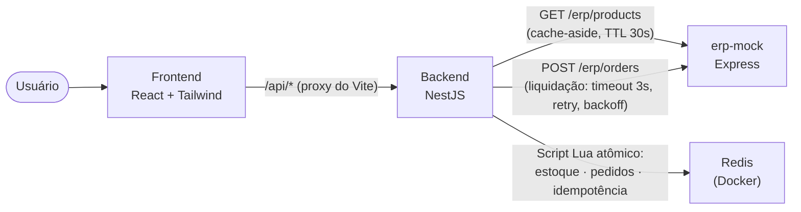

# CaseCellShop — Checkout (branch `redis`)

> **Esta branch demonstra a Fase 1 (Redis) da evolução descrita no README de `main`.** O checkout, o contrato HTTP e a UI são idênticos aos de `main` — a mesma suíte `e2e/` passa sem nenhuma alteração nela — só a infraestrutura por baixo mudou: reserva de estoque, idempotência e persistência de pedidos deixam de viver em `Map`s do processo Node e passam a viver no Redis (script Lua para atomicidade, TTL nativo para expiração de reserva). O objetivo é validar as ADR-001/002/003 de [`referencias/decisoes-tecnicas.md`](referencias/decisoes-tecnicas.md) contra infraestrutura de verdade, não só como texto. O que mudou em relação a `main` está resumido em ["Armazenamento: Redis, não mais em memória"](#armazenamento-redis-não-mais-em-memória) mais abaixo; o resto deste README é herdado de `main` e continua valendo sem alteração.

Uma fatia fullstack executável de uma jornada de checkout de e-commerce: o cliente escolhe um produto e uma quantidade, tenta comprar, e o sistema garante que nunca vende além do estoque disponível, nunca duplica um pedido em caso de retry ou duplo clique, e sempre responde rápido mesmo quando o sistema de ERP usado como backend de faturamento está lento ou instável.

O repositório contém três processos Node.js independentes — `erp-mock/`, `backend/`, `frontend/` — mais um `docker-compose.yml` só com o Redis (nesta branch, o backend depende dele; `main` não precisa de Docker). Um quarto pacote, `e2e/`, contém testes end-to-end (Playwright) que sobem os três serviços juntos e dirigem um navegador real contra a aplicação.

| Item bônus | Onde ver | Resultado |
|---|---|---|
| Diagrama de arquitetura | [Arquitetura e principais decisões técnicas](#arquitetura-e-principais-decisões-técnicas) | Fluxo completo usuário → frontend → backend → `erp-mock`, com o Redis como fronteira de estado explícita |
| Logs estruturados | [Rastreabilidade](#rastreabilidade-logs-estruturados-em-todo-o-fluxo) · [`evidencias/logs-backend.md`](evidencias/logs-backend.md) | Captura real cobrindo caminho feliz, os 4 tipos de erro, concorrência pela última unidade, idempotência e esgotamento de retry com o ERP |
| Endpoint de status do pedido | `GET /orders/:id` | Retorna `pending` / `confirmed` / `failed` (com `error.code`/`error.message` quando falha) |
| Teste de concorrência | [Armazenamento: Redis](#armazenamento-redis-não-mais-em-memória) | Várias requisições simultâneas pela última unidade de estoque — exatamente uma reserva passa, as demais recusadas com `409` (agora garantido por um script Lua atômico, não pelo event loop do Node) |

## Pré-requisitos

- Node.js 20 LTS
- npm
- Docker (só para o Redis local — `docker compose up -d redis`); sem Docker Desktop, um `redis-server` instalado localmente (ex. `brew install redis`) também serve, desde que esteja escutando em `redis://localhost:6379`

## Instalação e execução

### Rodando tudo com um comando

```bash
npm run install:all   # instala erp-mock, backend e frontend de uma vez
npm run dev            # sobe o Redis (docker compose), depois os três juntos, com saída colorida e prefixada
```

Os dois comandos rodam na raiz do repositório (`package.json` novo, com [`concurrently`](https://www.npmjs.com/package/concurrently) orquestrando os três processos Node; um hook `predev` sobe o Redis via `docker compose up -d redis` e espera ele responder antes de continuar — `scripts/wait-for-redis.sh`). `Ctrl+C` derruba os três processos Node de uma vez (o Redis continua rodando no Docker; `docker compose down` para ele). É equivalente ao passo a passo manual abaixo — use aquele se quiser rodar/reiniciar um serviço isoladamente, ou este para o dia a dia.

### Passo a passo manual

Redis primeiro (é uma dependência de boot do backend — sem ele, o backend não sobe), depois cada pacote independente em seu próprio terminal, **nesta ordem** — o backend busca o catálogo de produtos no `erp-mock` assim que sobe (e falha ao iniciar se não conseguir), então `erp-mock` precisa estar de pé antes dele; o frontend precisa do backend para qualquer dado real.

**0. Redis**

```bash
docker compose up -d redis
```

**1. ERP mock — porta 4000**

```bash
cd erp-mock
npm install
npm run dev
```

**2. Backend — porta 3001**

```bash
cd backend
npm install
npm run start:dev
```

**3. Frontend — porta 5173**

```bash
cd frontend
npm install
npm run dev
```

Abra `http://localhost:5173`. O servidor de desenvolvimento do Vite (frontend) faz proxy de `/api/*` para `http://localhost:3001` (veja `frontend/vite.config.ts`), então o navegador nunca fala diretamente com a porta do backend — apenas através desse proxy.

A API do backend tem documentação interativa (Swagger/OpenAPI) em `http://localhost:3001/docs` — schema completo (incluindo os corpos de erro de cada status) em `http://localhost:3001/docs-json`.

Nenhum dos três serviços precisa de arquivo `.env` para rodar com os valores padrão. `PORT` muda a porta do `erp-mock`/`backend`; o backend também lê `REDIS_URL` (padrão `redis://localhost:6379`, o que o `docker-compose.yml` já expõe), `ERP_MOCK_URL` (a URL da instância de `erp-mock` a ser chamada, padrão `http://localhost:4000`), e `ERP_SIM_MODE`/`ERP_SIM_DELAY_MS` (repassadas como headers para o `erp-mock` para forçar um comportamento simulado específico do ERP — `always-success`/`always-fail`/`always-timeout`/`random` — em vez do comportamento aleatório padrão). É assim que a suíte de testes e2e aponta o backend para uma instância de teste dedicada do `erp-mock` e conduz cada cenário de forma determinística; veja `backend/test/global-setup.ts` e `backend/src/erp/erp.service.ts`.

## Rodando os testes

**`erp-mock/`** (Jest + Supertest, executado diretamente contra o `app` do Express, sem precisar vincular porta):

```bash
cd erp-mock
npm test               # ou npm run test:coverage para o relatório de cobertura
```

**`backend/`** (Jest):

```bash
cd backend
npm test                    # testes unitários (*.spec.ts) — regras de negócio de ProductsService e CheckoutService
npm run test:e2e            # testes end-to-end (*.e2e-spec.ts) — contrato HTTP completo, incl. concorrência e idempotência
npm run test:coverage       # cobertura dos unitários
npm run test:e2e:coverage   # cobertura da suíte e2e
```

`npm run test:e2e` sobe o `erp-mock` automaticamente como um processo filho antes da suíte rodar e o encerra depois (`test/global-setup.ts` / `test/global-teardown.ts`, que fazem polling em `GET /health` antes de liberar os testes) — você **não** precisa ter o `erp-mock` já rodando em outro terminal especificamente para esse comando. Ele ainda é necessário como processo separado para o `start:dev`/uso manual do próprio backend, e para o fluxo do frontend acima.

**`frontend/`** (Vitest + React Testing Library):

```bash
cd frontend
npm test               # ou npm run test:coverage para o relatório de cobertura
```

**`e2e/`** (Playwright — sobe os três serviços de verdade e testa pelo navegador):

```bash
cd e2e
npm install
npx playwright install chromium   # só na primeira vez
npm test
```

Diferente das suítes acima, essa não testa uma unidade nem um contrato HTTP isolado — ela sobe `erp-mock`, `backend` e `frontend` como processos reais (via `webServer` do `playwright.config.ts`) e dirige um navegador Chromium contra a UI, cobrindo o caminho feliz, bloqueio por falta de estoque e uma falha simulada do ERP com recuperação. Por isso ela precisa que as portas 4000/3001/5173 estejam livres antes de rodar (encerre qualquer instância manual dos três serviços da seção "Instalação e execução"). Cada execução grava vídeo, screenshot e trace de cada teste em `e2e/test-results/` (git-ignorado); veja `evidencias/` na raiz do repositório para uma amostra já gravada.

Nesta branch, o backend do `webServer` roda com `REDIS_URL` apontando para um DB lógico dedicado (`redis://localhost:6379/2`, separado do `0` usado por `npm run dev` e do `1` usado pelos testes e2e do `backend/`), limpo automaticamente por um `globalSetup` (`e2e/global-setup.ts`) antes de cada execução — sem isso, o teste que espera "10 em estoque" no início falharia depois da primeira vez que alguém rodasse a suíte, porque o Redis (ao contrário do `Map` em memória de `main`) lembra o estoque entre execuções.

## Cenários de teste manual

Com os três serviços de pé (`npm run dev`, numa aba separada), `scripts/scenarios.sh` dispara cenários reais contra a API via `curl`, com saída legível — útil pra explorar o comportamento na mão sem escrever `curl` a cada vez:

```bash
scripts/scenarios.sh all   # roda todos os cenários abaixo em sequência
```

| Comando | O que faz |
|---|---|
| `products` | `GET /products`, formatado |
| `happy` | Checkout de 1 unidade, com polling até `confirmed` |
| `out-of-stock` | Pede mais unidades do que há em estoque disponível |
| `concurrency` | Dispara `estoque+1` requisições concorrentes pela última unidade, conta `202` vs. `409` |
| `idempotency` | Duas chamadas com a mesma `Idempotency-Key`, confirma que é o mesmo `orderId` |
| `erp-failure` | Roda um checkout e reporta o desfecho real do ERP |
| `status <orderId>` | Consulta um pedido específico |

O cenário `erp-failure` só é determinístico se o backend tiver sido iniciado com `ERP_SIM_MODE=always-fail npm run dev` (ver "Instalação e execução" acima) — com o modo `random` padrão, o script avisa isso na tela e reporta o que aconteceu de verdade. O script não sobe nem derruba nenhum processo — só assume que `npm run dev` já está rodando em outra aba.

Só nesta branch, mais três comandos que exercitam o que o Redis muda de verdade:

| Comando | O que faz |
|---|---|
| `keys` | Inspeciona `order:*`, `product:stock:*`, `reservation:*` direto no `redis-cli`, sem passar pela API |
| `restart before` / `restart after <orderId>` | `before` cria um pedido e pede pra você reiniciar o backend manualmente (Ctrl+C + `npm run dev` de novo); `after` confirma que o pedido e o estoque sobreviveram — de propósito não é automático, já que derrubar o processo que você está olhando rodar em outro terminal não é algo que este script deveria fazer sozinho |
| `ttl` | Demo isolada do TTL nativo (`SET ... EX 3`) mostrando uma reserva sumir sozinha do Redis, sem nenhum código da aplicação envolvido |

## Arquitetura e principais decisões técnicas



*A reserva de estoque, os pedidos e as chaves de idempotência vivem no Redis, não mais dentro do processo do backend — o `erp-mock` nunca é consultado durante a checagem-e-reserva (um script Lua atômico no Redis, ver "Armazenamento" abaixo), só na liquidação em segundo plano e nos refreshes periódicos do catálogo.*

### Por que `erp-mock` é um serviço HTTP real separado, e não uma simulação in-process

O backend chama o `erp-mock` através de uma fronteira de rede real (HTTP, processo próprio, porta própria) em vez de simular o comportamento do ERP com uma classe in-process. Essa é uma escolha deliberada de gestão de risco, não incidental: uma simulação in-process não consegue exercitar os modos de falha que realmente importam para a resiliência do checkout — reset de conexão, um timeout que de fato precisa correr contra o relógio (`Promise.race` perdendo, não apenas uma função retornando um erro), uma resposta lenta competindo com o próprio event loop do backend. Um segundo processo real também é o que obriga o modo de simulação do `erp-mock` a ser **stateless e controlado por header**, em vez de configuração no lado do servidor: duas tentativas de checkout concorrentes na mesma execução de teste podem exigir comportamentos simulados diferentes (`always-success` vs. `always-timeout`) sem disputar um estado mutável compartilhado.

O `erp-mock` é um serviço Express simples, e não uma segunda aplicação NestJS — é um dublê de teste representando um sistema fora do controle deste projeto, não parte do produto sendo construído.

### Catálogo: o ERP é o dono dos dados, a loja só lê

Produto, preço, estoque contábil e a foto de cada capinha são dados que o `erp-mock` expõe em `GET /erp/products` — não um array chumbado dentro do backend. Nesta branch, o `ProductsService` busca esse catálogo com **cache-aside no Redis** (`catalog:products`, TTL 30s — ADR-001 de [`referencias/decisoes-tecnicas.md`](referencias/decisoes-tecnicas.md)): a primeira leitura depois que o cache expira busca no `erp-mock` e regrava o cache; as leituras seguintes, dentro da janela de 30s, nem tocam o ERP. Um *warm-up* no boot (`ProductsService.onModuleInit`) preenche o cache antes do Nest aceitar requisições, preservando o mesmo comportamento de "falha ao iniciar se o `erp-mock` estiver fora do ar" que a versão em memória de `main` tem.

O ERP continua sendo o único *escritor* de catálogo/preço/estoque contábil, a loja sempre *leitora* — mas o estoque disponível para reserva (`product:stock:{productId}` no Redis) é semeado só na primeira vez que cada produto é visto (`SET ... NX`), nunca sobrescrito pelos refreshes seguintes do cache-aside: o `erp-mock` é estático e não sabe quando a loja confirma uma venda, então sobrescrever a cada refresh apagaria um débito de estoque já confirmado, reabrindo a porta para overselling — exatamente o problema que esta branch existe para fechar. É o mesmo comportamento que a versão em memória de `main` já tinha (buscar o catálogo uma vez, e daí em diante só a loja mexe no número), só que agora sobrevivendo a um restart. Depois que o estoque é semeado, a reserva/decremento continua inteiramente dentro do Redis (ver seção seguinte) — nenhuma chamada ao ERP acontece durante um checkout, só no boot e nos refreshes periódicos do catálogo.

### Arquitetura do backend: Controller, Service, Module

O backend segue uma estrutura NestJS direta — um `Controller`, um `Service`, um `Module` por assunto (`products/`, `orders/`, `idempotency/`, `erp/`, `checkout/`). Cada `Controller` faz apenas roteamento: nenhuma regra de negócio, nenhum mapeamento de erro para status HTTP (isso é centralizado uma única vez, no `HttpExceptionFilter` global). Cada `Service` é dono tanto da lógica de negócio quanto dos dados sobre os quais ela opera, em um só lugar, sem camadas de indireção adicionais entre o controller e a regra de negócio. Erros de domínio (produto não encontrado, estoque insuficiente, pedido não encontrado) são exceções tipadas que estendem `HttpException` diretamente, e métodos/variáveis usam o vocabulário real do negócio (`reserveStock`, `settleWithErp`, `idempotencyKey`) em vez de nomenclatura CRUD genérica.

`ProductsService` combina o catálogo de produtos e a reserva de estoque no mesmo serviço porque `GET /products` precisa dos dois, e separá-los em dois serviços que dependem um do outro criaria uma dependência circular sem benefício nesta escala.

### Armazenamento: Redis, não mais em memória

Estoque, pedidos e chaves de idempotência vivem no Redis (`docker-compose.yml`, persistência AOF habilitada) em vez de `Map`s no processo do backend — a diferença central desta branch em relação a `main`, e o motivo dela existir. A mesma garantia de correção (nunca vender além do estoque) continua vindo de uma operação indivisível, só que sustentada por um mecanismo diferente: em `main`, o event loop síncrono do Node garante que duas chamadas à mesma função nunca se intercalam; aqui, é o Redis que garante que um script Lua roda do início ao fim sem interrupção de outro comando — a mesma classe de garantia (atomicidade), infraestrutura diferente por baixo.

**Esquema de chaves:**

| Chave | Tipo | Papel |
|---|---|---|
| `catalog:products` | String (JSON), TTL 30s | Cache-aside do catálogo (nome/preço/imagem) |
| `product:stock:{productId}` | String (inteiro) | Estoque base — semeado uma vez (`SET NX`), só muda por confirmação de venda |
| `product:reservations:{productId}` | Hash `orderId → quantity` | Reservas já vistas para o produto, podadas de forma preguiçosa |
| `reservation:{orderId}` | String, TTL 120s | Fonte da verdade de "essa reserva ainda está ativa" — some sozinha quando o TTL expira |
| `order:{orderId}` | Hash | Os campos do pedido — sem TTL, é o que sustenta sobreviver a um restart |
| `order:seq` | Contador (`INCR`) | Gera `ord_NNNNNN` sem colisão entre restarts |

**Três scripts Lua** (`backend/src/redis/lua/*.lua`, registrados via `ioredis`'s `defineCommand`) cobrem as três operações que precisam ser atômicas: `reserveStock` (poda reservas expiradas, soma as ativas, compara com o estoque base, grava se couber), `confirmReservation` (debita o estoque base permanentemente e remove a reserva — no-op se ela já não existir, o que evita debitar duas vezes) e `releaseReservation` (remove a reserva sem debitar). Os três são revisáveis linha a linha nesses arquivos — é exatamente o que a ADR-002 pede como compliance ("revisão manual do script Lua no code review").

O teste e2e de concorrência (`backend/test/checkout.e2e-spec.ts`, mesmo texto de `main`) e um teste unitário adicional só desta branch (`products.service.spec.ts`, "lets only one of two concurrent reservations for the last unit succeed", rodando contra Redis real) são a garantia de regressão automatizada. Validado manualmente também, com captura de terminal real — matar o processo do backend (`kill -9`) e religá-lo mantém pedido e estoque exatamente como estavam, e uma reserva expira sozinha por TTL nativo do Redis sem nenhum código da aplicação envolvido — ver [`evidencias/logs-redis.md`](evidencias/logs-redis.md) para os oito cenários comentados (log bruto sem edição em [`evidencias/logs-redis.txt`](evidencias/logs-redis.txt)).

### Frontend: Tailwind e fotos reais dos produtos

A tela de checkout é responsiva (testada de ~360px a desktop) e usa Tailwind CSS v4 (via `@tailwindcss/vite`, sem arquivo de config separado — os tokens de cor e tipografia vivem em `frontend/src/index.css`). O seletor de produto deixou de ser um `<select>` para virar um grupo de cards clicáveis (`role="radiogroup"`, um `<input type="radio">` acessível por trás de cada card), porque a foto do produto — vinda de `product.imageUrl`/`imageAlt`, ver "Catálogo" acima — só faz sentido como algo grande o bastante para ver a textura da capinha; um dropdown não comporta isso. O card também mostra preço e estoque disponível, recarregado do backend assim que uma compra reserva ou libera estoque, sem precisar dar reload na página.

`frontend/src/` é organizado por responsabilidade, não por tipo de arquivo genérico: `services/` fala com o backend (um módulo por recurso — `products`, `checkout`, `orders` — cada um só com as chamadas `fetch` e os tipos daquele recurso); `hooks/` (`useProducts`, `useCheckout`) guardam o estado e a lógica de quando chamar cada serviço, incluindo o polling do status do pedido; `view/` são componentes de apresentação que só recebem props e renderizam; `controller/CheckoutController.tsx` é o único lugar que conecta hooks a views; `utils/` guarda funções puras sem estado (formatação de moeda, montagem de URL de imagem). Essa separação usa o mesmo vocabulário do backend (`services`) de propósito, e existe por um motivo concreto, não só organização por gosto: antes, uma função de ~90 linhas fazia fetch, tratava todos os erros e renderizava tudo junto, e um erro de rede (não um erro HTTP — uma falha de conexão de verdade) não era capturado em lugar nenhum, deixando o botão "Processando..." travado para sempre. Isolar a chamada de rede dentro de `hooks/useCheckout.ts` tornou esse ponto óbvio o bastante para corrigir: agora `postCheckout`/`fetchOrderStatus` são chamados dentro de um `try/catch` que sempre leva a UI de volta a um estado de erro navegável.

### Por que a idempotência só guarda em cache a resposta de sucesso

Uma requisição `POST /checkout` que falha na validação, ou aponta para um produto inexistente, ou esbarra em estoque insuficiente, é uma função pura da entrada e do nível de estoque atual — reenviar exatamente a mesma requisição recalcula exatamente a mesma resposta, sem efeito colateral para repetir acidentalmente. A única resposta que não é pura é o sucesso `202 pending`, porque ela tem um efeito colateral: cria um pedido e reserva estoque. Por isso só esse caminho é lembrado em relação à `Idempotency-Key` — reenviar a mesma chave retorna o pedido *original* em vez de criar um segundo pedido e reservar estoque em dobro.

### Rastreabilidade: logs estruturados em todo o fluxo

Cada classe do backend tem seu próprio `Logger` do NestJS (`new Logger(NomeDaClasse.name)`), e todo ponto de decisão do fluxo é logado — não só os erros: pedido recebido, resposta idempotente reaproveitada, estoque reservado/recusado/confirmado/liberado (inclusive quando uma reserva expira sozinha por TTL), cada tentativa de chamada ao ERP com seu resultado, o backoff entre tentativas, e o desfecho final do pedido. As mensagens seguem um padrão consistente de `mensagem em português — campo1=valor1 campo2=valor2`, para ficarem ao mesmo tempo legíveis por humano e fáceis de grep. Os níveis são usados com intenção: `log` para o caminho esperado, `warn` para falhas de negócio recuperáveis (estoque insuficiente, tentativa de ERP que falhou mas ainda tem retry, um pedido marcado `failed`), `error` só para o que realmente esgotou as opções (falha definitiva após as 3 tentativas, exceção não tratada), e `debug` para ruído de diagnóstico de baixo sinal (hit/miss de idempotência, guards que decidiram não fazer nada).

Duas chaves de correlação amarram essas linhas: um `requestId` curto, gerado por `RequestLoggerMiddleware` para toda requisição HTTP (reaproveita um `X-Request-Id` recebido, se houver, e sempre devolve um no header de resposta) e logado nas linhas de entrada/saída (`--> POST /checkout ...` / `<-- POST /checkout ... status=202 durationMs=...`); e o `orderId`, que passa a ser a chave de correlação a partir do momento em que um pedido existe — inclusive na liquidação assíncrona com o ERP, que roda bem depois da requisição HTTP original já ter sido respondida e por isso não tem mais um `requestId` "ativo" a que se prender.

Uma captura real desses logs, cobrindo o caminho feliz, os quatro tipos de erro (`400`/`404`/`409`/pedido `failed`), duas tentativas concorrentes pela última unidade de um produto, o reaproveitamento idempotente, e o esgotamento das 3 tentativas contra o ERP, está em [`evidencias/logs-backend.md`](evidencias/logs-backend.md) (comentada cenário a cenário; a saída de terminal bruta e sem edições fica em [`evidencias/logs-backend.txt`](evidencias/logs-backend.txt)).

### Fora de escopo

- **Autenticação, pagamento real, deploy em nuvem.** (Docker deixa de ser opcional nesta branch — é como o Redis local sobe; ver "Pré-requisitos" para a alternativa sem Docker Desktop.)
- **Carrinho com múltiplos itens** — o checkout permanece single-item (`productId` + `quantity`) porque nenhuma das garantias centrais deste projeto (consistência de estoque, idempotência, concorrência, contrato de erro) depende de um carrinho; adicionar um transformaria a reserva indivisível de um único produto em um problema de write-skew multi-objeto, exigindo um redesign, não uma extensão incremental.
- **Fila durável (RabbitMQ/BullMQ), banco de dados dedicado, sincronização por CDC com um ERP real** — pertencem a uma evolução de produção deste desenho, não a este mini-projeto de código.
- **Um cron de reconciliação automatizado de verdade**, rodando como processo agendado real — documentado aqui como próximo passo; `GET /orders/:id` já cobre a necessidade imediata de ver o status atual de um pedido.
- **Testes de contrato formais (Pact) e testes de carga/performance** — próximo passo, não prioridade para esta entrega.
- **Um layout de UI elaborado** — não é o foco desta entrega.

## Próximos passos: uma branch com Redis já construída, e uma com Redis + fila planejada

O em-memória do mini-projeto original (`main`) é uma escolha deliberada de escopo, não desconhecimento do que uma versão de produção exige — as ADRs de [`referencias/decisoes-tecnicas.md`](referencias/decisoes-tecnicas.md) já especificam essa evolução em fases, respondendo à Pergunta 1/2 de [`Parte 1.A — Perguntas Conceituais.md`](Parte%201.A%20—%20Perguntas%20Conceituais.md). Esta branch (`redis`) já materializa a Fase 1 como código real, validado em [`evidencias/logs-redis.md`](evidencias/logs-redis.md); a Fase 2 (`redis-queue`) segue só planejada, não construída, para comparar as três versões lado a lado sob os mesmos testes de concorrência/idempotência:

| | **`main`** | **Esta branch (`redis`, Fase 1)** | **Branch planejada `redis-queue`** (Fase 2) |
|---|---|---|---|
| Reserva de estoque | `Map` em memória, checagem-e-reserva síncrona no processo | Script Lua no Redis, mesma garantia de operação atômica (ADR-002) | Igual à Fase 1 |
| Idempotência | `Map` em memória, sem TTL (processo de vida curta) | Chave no Redis, TTL 24h (ADR-003) | Igual à Fase 1 |
| Liquidação com o ERP | Retry in-process (3x, backoff), sem fila | Igual ao mini-projeto (ADR-004) | Fila durável (BullMQ/RabbitMQ) com dead-letter queue — o pedido nunca se perde num restart (ADR-005) |
| Persistência de pedidos/estoque | Só no processo — perde tudo num restart | Redis — sobrevive a um restart do processo da loja | Banco próprio da loja (Postgres); Redis vira só fila/cache |
| Catálogo | Busca única no `erp-mock`, no boot | Cache-aside com TTL curto (~30s) (ADR-001) | Igual à Fase 1 |
| Infraestrutura extra | Nenhuma — só Node.js | +1 Redis | +Redis, +fila, +Postgres |

Por que branches separadas em vez de uma flag de configuração: cada fase troca uma garantia de corretude por uma peça de infraestrutura diferente (Redis primeiro, banco+fila depois) — misturar as três num único código com `if`s de ambiente esconderia exatamente o trade-off que vale a pena mostrar. Cada branch reaproveita os mesmos testes de concorrência e idempotência deste mini-projeto como critério de aceite: a garantia observável (nunca vende além do estoque, nunca duplica pedido) tem que se manter idêntica trocando só a infraestrutura por baixo.

## Contrato da API (resumo)

- `GET /products` — lista o catálogo semeado com o estoque *disponível* de cada produto (estoque base menos reservas ativas).
- `POST /checkout` — corpo `{ productId, quantity, idempotencyKey }` (a chave também pode ser enviada como o header `Idempotency-Key`). Retorna `202` com `{ orderId, status: "pending", statusUrl }` em caso de sucesso; `400 VALIDATION_ERROR`, `404 PRODUCT_NOT_FOUND`, ou `409 OUT_OF_STOCK` em caso de falha.
- `GET /orders/:id` — status atual do pedido (`pending` | `confirmed` | `failed`, com `error: { code, message }` quando `failed`); `404 ORDER_NOT_FOUND` para um id desconhecido.

O contrato exato, incluindo cada campo e código de status, está detalhado em [`specs/spec.md`](specs/spec.md) — e, de forma sempre sincronizada com o código (gerada a partir dos mesmos decorators dos controllers), em `http://localhost:3001/docs` com o backend rodando.

## Evidências e testes automatizados

A pasta [`evidencias/`](evidencias/) contém gravações em vídeo (`.webm`) de uma execução real da suíte `e2e/`, uma por cenário:

| Cenário | Arquivo | Resultado |
|---|---|---|
| Caminho feliz | [`01-caminho-feliz.webm`](evidencias/01-caminho-feliz.webm) | Seleciona um produto, confirma a compra, o polling chega em "Compra confirmada!" contra o backend real (ERP simulado forçado a sempre ter sucesso), estoque exibido no card cai de 10 para 9 sem reload |
| Estoque insuficiente | [`02-estoque-insuficiente.webm`](evidencias/02-estoque-insuficiente.webm) | Pede mais unidades do que há em estoque numa única tentativa; backend rejeita antes de reservar qualquer coisa, UI mostra "Este produto está esgotado no momento." |
| Falha do ERP e retry | [`03-falha-erp-e-retry.webm`](evidencias/03-falha-erp-e-retry.webm) | Primeira tentativa falha (interceptação de rede do navegador, sem alterar código da aplicação), UI mostra a mensagem de falha temporária; segunda tentativa, sem interceptação, recupera normalmente |

Essas gravações não substituem a suíte automatizada — são uma amostra point-in-time de uma execução; a fonte da verdade é sempre rodar `npm test` em `e2e/` (ou as suítes unitárias/e2e de cada pacote, na seção anterior).

[`evidencias/logs-backend.md`](evidencias/logs-backend.md) complementa isso do lado do backend: captura real do terminal rodando o backend duas vezes (`ERP_SIM_MODE=always-success` e `always-fail`) e disparando `curl` contra cada cenário, comentada trecho a trecho.

| Cenário coberto | Resultado |
|---|---|
| Caminho feliz | Pedido `202 pending` → `confirmed` após liquidação com o ERP |
| `400`/`404`/`409` | Corpo de erro tipado retornado e logado em cada caso (validação, produto inexistente, estoque insuficiente) |
| Concorrência | Duas tentativas simultâneas pela última unidade — uma reserva, a outra recusada |
| Idempotência | Mesma `Idempotency-Key` reenviada retorna o pedido original, sem duplicar reserva |
| Falha do ERP | 3 tentativas esgotadas com backoff, pedido termina `failed` com `ERP_PROCESSING_FAILED` |

Só desta branch: [`evidencias/logs-redis.md`](evidencias/logs-redis.md) valida especificamente o que mudou — reserva atômica via Lua sob concorrência, pedido e estoque sobrevivendo a um `kill -9` do processo, e uma reserva expirando sozinha por TTL nativo do Redis:

| Cenário coberto (só nesta branch) | Resultado |
|---|---|
| Restart do processo (`kill -9` + religa) | Pedido e estoque idênticos a antes do restart — não seria verdade em `main` |
| TTL nativo de uma reserva | Chave some sozinha do Redis, sem cron nem sweep da aplicação |
| Inspeção direta das chaves (`redis-cli`) | Confirma que o esquema de chaves descrito acima é real, não só a API respondendo certo |

[`evidencias/coverage-report.md`](evidencias/coverage-report.md) traz os números reais de cobertura (`--coverage` do Jest/Vitest, não estimados) de cada suíte, com o texto bruto de cada ferramenta:

| Suíte | Statements | Testes |
|---|---|---|
| `backend` — unitários | 66.10% | 12 |
| `backend` — e2e | 92.23% | 15 |
| `erp-mock` | 96.15% | 7 |
| `frontend` | 82.11% | 8 |

## Troubleshooting

**`Error: connect ECONNREFUSED 127.0.0.1:6379` ao rodar o backend ou os testes**

O Redis não está de pé. Suba com `docker compose up -d redis` (requer Docker rodando) ou, sem Docker, um `redis-server` local escutando em `6379` (`brew install redis && redis-server --daemonize yes` no macOS). `backend/test/global-setup.ts` já falha rápido com essa mesma orientação se os testes e2e não conseguirem conectar.

**`EADDRINUSE` ao reiniciar o backend manualmente**

`nest start --watch` sobe um processo filho que sobrevive a matar só o processo `npm` — mata pela porta, não pelo PID: `lsof -ti:3001 | xargs kill -9`. É o mesmo cuidado que o script de captura de evidência (`evidencias/`) usa entre as duas execuções.

**Testes unitários de `ProductsService` falhando com dados de uma execução anterior**

Esses testes rodam contra Redis real, não fakes — se algo interromper a suíte no meio (`Ctrl+C`), o banco de teste (`redis://localhost:6379/1`, DB lógico separado do `0` usado por `start:dev`) pode ficar com chaves de uma reserva inacabada. `redis-cli -n 1 flushdb` limpa; rodar a suíte de novo também limpa sozinho (`beforeEach` já faz `flushdb`).

**Estoque parece "errado" depois de várias execuções manuais seguidas**

`product:stock:{productId}` é semeado só uma vez (`SET NX`) e só muda por venda confirmada — reiniciar o backend não reseta o catálogo para os valores originais do `erp-mock`, de propósito (ver ["Catálogo"](#catálogo-o-erp-é-o-dono-dos-dados-a-loja-só-lê) acima). Para voltar ao estado inicial (5/10/1), `redis-cli flushdb` antes de religar o backend.
=======
[`evidencias/coverage-report.md`](evidencias/coverage-report.md) traz os números reais de cobertura (`--coverage` do Jest/Vitest, não estimados) de cada suíte, com o texto bruto de cada ferramenta:

| Suíte | Statements | Testes |
|---|---|---|
| `backend` — unitários | 65.84% | 11 |
| `backend` — e2e | 93.27% | 15 |
| `erp-mock` | 96.15% | 7 |
| `frontend` | 82.11% | 8 |
>>>>>>> 03b7af8 (test: stress more scenarios, add coverage tooling and evidencias/coverage-report.md)

## Leitura complementar

- [`specs/spec.md`](specs/spec.md) — a especificação comportamental completa: histórias de usuário, decisões de implementação, modelo de dados, decisões de teste, lista de fora de escopo.
- [`specs/constitution.md`](specs/constitution.md) — governança do projeto: stack, diretrizes de código, arquitetura Controller/Service/Module, regras de teste.
- [`PROMPTS.md`](PROMPTS.md) — como a IA foi usada para construir este projeto.
